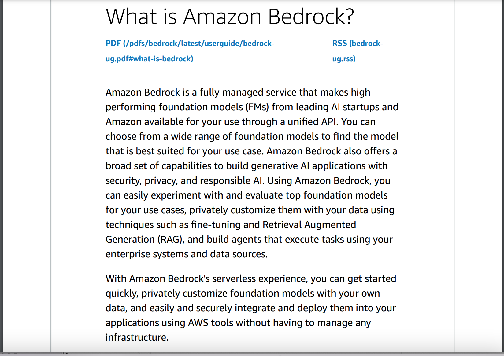

# Service Code for summarizing PDF
This is a server side code for a simple application to summarize content of a PDF file. Below diagram shows interaction between different components of this application:


This code parses the uploaded file and extracts the text from the pdf. The text is then augmented with a specific prompt which is sent as input to the Gen AI Base Model. The model then responds with the text response that the service relays to the client. Source code to do this is given below:

```
const parser = require('lambda-multipart-parser')  
const pdf = require('pdf-parse')
const { BedrockRuntimeClient, InvokeModelCommand } = require("@aws-sdk/client-bedrock-runtime");
exports.handler = async function(event, context) {
  const result = await parser.parse(event);
  let resText = '';
  if(result.files?.length){
    const d = await pdf(result.files[0].content);
    let txt = d.text;
    var prompt = `Human:You are an expert assistant with expertise in summarizing and pulling 
                  out important sections of a text. The following text is from a PDF document. 
                  Follow these steps: read the text, summarize the text, and identify the main ideas.
                  In your response include the summary and bullet points for the main ideas. 
                  Do not respond with more than 5 sentences.\n<TEXT>${txt}</TEXT>\n\nAssistant:`;
    const client = new BedrockRuntimeClient({
        serviceId: 'bedrock',
        region: 'us-east-1',
        });
    const input = {
        modelId: 'anthropic.claude-v2',
        contentType: "application/json",
        accept: "application/json",
        body: JSON.stringify({
        prompt: prompt,
        max_tokens_to_sample: 2000,
        temperature: 0.5,
        top_k: 250,
        top_p: 1,
        stop_sequences: ['\n\nHuman:'],
        anthropic_version: 'bedrock-2023-05-31'
        }),
    };
    const command = new InvokeModelCommand(input);
    const response = await client.send(command);

    // The response is a Uint8Array of a stringified JSON blob
    // so you need to first decode the Uint8Array to a string
    // then parse the string.
    let res2 = new TextDecoder().decode(response.body);
    return JSON.parse(res2);   
  }
  return 'error';
}

```


Full source code for UI is available here. [https://github.com/sekharkafle/pdfui](https://github.com/sekharkafle/pdfui)

### Prompt Engineering
Prompts are inputs into a generative AI model. Sending better prompts to the model will generate better results. There are various techniques to enhance prompts (See [https://cloud.google.com/blog/products/application-development/five-best-practices-for-prompt-engineering](https://cloud.google.com/blog/products/application-development/five-best-practices-for-prompt-engineering)). One such technique is to make prompt very specific for the desired outcome. 

To demonstrate this, lets start with this content as our input document.



In our service code, we have defined the prompt with instruction to summarize the PDF content with 5 sentences max in the code snippet given below:
```
var prompt = `Human:You are an expert assistant with expertise in summarizing and pulling 
                  out important sections of a text. The following text is from a PDF document. 
                  Follow these steps: read the text, summarize the text, and identify the main ideas.
                  In your response include the summary and bullet points for the main ideas. 
                  Do not respond with more than 5 sentences.\n<TEXT>${txt}</TEXT>\n\nAssistant:`;
```

An output from the AI model to the above prompt is shown below:

```
 Here is a 5 sentence summary of the key points:

Amazon Bedrock is a managed service that provides access to foundation models
 for building AI applications. It allows users to experiment with top models, 
 customize them with personal data via fine-tuning, and integrate them into 
 apps using AWS tools. Key features are experimenting with models via an API 
 or console, creating knowledge bases to augment model responses, and secure 
 deployment without managing infrastructure. Amazon Bedrock is serverless, 
 allows quick startup, and enables private customization of models. It is 
 available in certain AWS regions with tiered pricing models.

The main ideas are:
- Access to foundation models 
- Customization via fine-tuning
- Integration with AWS services
- Serverless and quick start
- Private customization
```

Now, lets play with this prompt a bit and change it to generate one sentence summary.

Input Prompt:
```
Human:You are an expert assistant with expertise in summarizing and pulling
out important sections of a text. The following text is from a PDF document. 
Respond with 1 sentence summary of the text.\n<TEXT>${pdfContent}</TEXT>\n\nAssistant:
```

Model output:
```
Amazon Bedrock is a managed service that provides access to foundation models for
 building AI applications with capabilities like fine-tuning models, integrating 
 with enterprise systems, and responsible AI.
 ```
We have sucessfully demonstrated one prompt engineering approachto generate desired text summary from the AI model.

Please check this link for end-to-end solution. [http://kafles.com/2024/04/20/practical-llm2/](http://kafles.com/2024/04/20/practical-llm2/)

Happy Summarizing!!!


